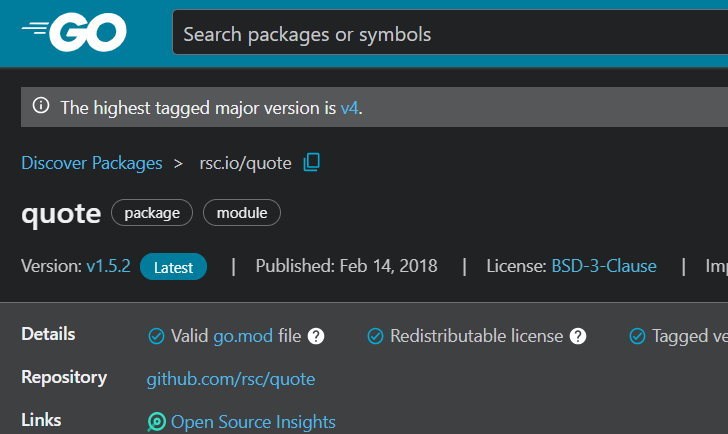

# Introduction

I am planning to learn GO by reading the official Documentation. This section will server as the notes that I will take whil learning GO

# Installing GO

- There is a way to manage GO Version and there is a straigh forward installation
- I am going with downloading the 1.26.2 version of GO

# Getting Started

- When your code imports packages contained in other modules, you manage those dependencies through your code's own module. That module is defined by a `go.mod` file.
- That go.mod file stays with your code, including in your source code repository.
- To enable dependency tracking for your code by creating a go.mod file, run the `go mod init` command, giving it the name of the module your code will be in. The name is the module's module path.
- In actual development, the module path will typically be the **repository location where your source code will be kept**. For example, the module path might be **github.com/mymodule**. If you plan to publish your module for others to use, the module path must be a location from which Go tools can download your module.

```shell
mkdir hello
cd hello
go mod init eample/hello
```

- After running this command I can see a go.mod file created and also it has the following structure

```markdown
module example/hello

go 1.26.2
```

# Writing your first code

- In the `hello` directory, I initialized the `go.mod` file and created a `hello.go` file.
- I observed that importing packages such as `fmt` requires double quotes (`"fmt"`). Using single quotes throws an error because single quotes are used for `rune literals (Single Chatacters)` in Go, not strings.
- `Println()` is a function in the `fmt` package used to print output to the console.
- Another useful observation is naming and visibility in Go: identifiers starting with an uppercase letter are exported (accessible from other packages), while identifiers starting with a lowercase letter are unexported (package-private behavior). Go does not use explicit `public` or `private` keywords.
- To run the hello world program, I use the command:

```shell
go run hello.go
```

- In the official documentation, when I am inside the `hello` directory and run the command:

```shell
go run .
```

Go builds and runs the package in the current directory (it does not select only `hello.go`). All non-test `.go` files in the same directory should belong to the same package.

```shell
PS C:\hello> go run .
# example/hello
.\hello2.go:7:6: main redeclared in this block
        .\hello.go:7:6: other declaration of main
```

- This error occurs because both files define `func main()` in the same package.
- If I provide a specific file name (instead of `.`), only that file is run, so this conflict may not appear.
- Another obervation if you run a file using the go run command and if the func main is not defined then it throws error when you run that file. (# Read about this)

# Call code in an external package

- When you need your code to do something that might have been implemented by someone else, you can look for a package that has functions you can use in your code.

```link
https://pkg.go.dev/search?q=quote
```

- This is the repository for searching packages created by others, similar to `npm`
- if you look carefully you can see a lot of versions of the package listed over there.
- In the top you can see the pacakge it is rsc.io/quote.
  
  You can use the pkg.go.dev site to find published modules whose packages have functions you can use in your own code. Packages are published in modules -- like rsc.io/quote -- where others can use them. Modules are improved with new versions over time, and you can upgrade your code to use the improved versions.

# `go tidy`

- When we imported the rsc.io/quote in our code for the first time it could not resolve the module as it was un aware where it is coming from
- when we run the `go tidy` command it automatically searched the package repository and adds it to the go.mod file. Basically it adds it as dependency
- When you ran go mod tidy, it located and downloaded the rsc.io/quote module that contains the package you imported. By default, it downloaded the latest version -- v1.5.2.

# GO Lang book

## Go Basics: Compilation & Structure

Go is a **compiled language**. The Go toolchain converts source code and its dependencies into native machine language instructions. All tools are accessed via the `go` command.

### Core Toolchain Commands

- **`go run`**: Compiles source code from `.go` files, links libraries, and runs the resulting executable immediately.
```bash
  $ go run helloworld.go
```
- **`go build`**: Compiles the code and saves it as a **reusable executable binary** file.
```bash
  $ go build helloworld.go
  $ ./helloworld
```
- **`go get`**: Fetches source code from a repository and places it in the corresponding directory.

### Code Organization & Packages

- **Definition**: A **package** consists of one or more `.go` source files in a single directory that define what the package does. It is similar to a library or module in other languages.
- **Standard Library**: Go provides over 100 packages for common tasks (e.g., `fmt` for formatted I/O, sorting, text manipulation).
- **File Structure**: Every source file follows this order:
  1.  **Package Declaration**: (e.g., `package main`)
  2.  **Import List**: Other packages needed for the code.
  3.  **Program Declarations**: Functions, variables, etc.

### The Entry Point

`Read the program hello/hello.go`

- **`package main`**: This is a special package that defines a **standalone executable** program rather than a library.
- **`func main()`**: A special function within `package main` where program execution begins.
- **`fmt.Println`**: A basic function from the `fmt` package that prints values separated by spaces with a newline at the end.

## Imports and Program Structure

### The `import` Declaration

- **Requirement**: You must import **exactly** the packages you need.
- **Strictness**: A program will not compile if there are missing imports or if there are unnecessary (unused) ones. This prevents the accumulation of unused dependencies.
- **Placement**: The `import` declarations must follow the `package` declaration at the top of the file.

### Program Declarations

A Go program primarily consists of four types of declarations:

1. **`func`**: Functions
2. **`var`**: Variables
3. **`const`**: Constants
4. **`type`**: Types

> **Note**: For the most part, the order of these declarations within a file does not matter.

### Function Syntax

A function declaration consists of:

- The keyword `func`.
- The **name** of the function.
- A **parameter list** (enclosed in parentheses).
- A **result list** (the return types).
- The **body**: The statements defining what the function does, enclosed in braces `{ }`.

### Semicolons and Newlines

- **Semicolons**: Go does not require semicolons at the ends of statements or declarations, except when placing multiple statements on a single line.
- **Automatic Insertion**: The Go compiler automatically converts certain newlines into semicolons.
- **Brace Rule**: Because of how newlines are parsed, the opening brace `{` of a function **must** be on the same line as the `func` declaration, not on a line by itself.
- **Operators**: In expressions (like `x + y`), a newline is permitted **after** the `+` operator, but not before it.

### Code Formatting Tooling

- **`gofmt`**: A tool that rewrites Go source code into a standard format. It eliminates debates over coding style and enables automated code transformations.
- **`go fmt`**: The command used to apply `gofmt` to all files in a package or directory.
- **`goimports`**: A related tool (not part of the standard distribution) that automatically manages the insertion and removal of `import` declarations as you code. Note: add this in your project when you create one, this will add this tool in your go.mod file
```bash
$ go get golang.org/x/tools/cmd/goimports
```

## Command-Line Arguments

Most programs require external input to operate. One of the simplest ways to provide this is via command-line arguments.

### The `os.Args` Variable
* **Definition**: `os.Args` is a **slice of strings** provided by the `os` package that contains the command-line arguments used to run the program.
* **Indexing**:
    * `os.Args[0]` is the name of the command itself.
    * `os.Args[1:]` contains the actual arguments passed by the user.
* **Slices**: These are dynamically sized sequences. Go uses **half-open intervals** for slicing (`s[m:n]`), which include the first index but exclude the last (i.e., elements $m$ through $n-1$).


---

### The `for` Loop
Go only has one looping construct: the `for` loop. It has three primary forms:

1.  **The Traditional Form**: Includes initialization, condition, and post-iteration statement.
    ```go
    for i := 1; i < len(os.Args); i++ {
        // logic
    }
    ```
2.  **The "While" Form**: Only the condition is present.
    ```go
    for condition {
        // logic
    }
    ```
3.  **The Infinite Loop**: No condition; it runs until a `break` or `return` is reached.
    ```go
    for {
        // logic
    }
    ```


---

### Iterating with `range`
The `range` keyword is used to iterate over a slice or map. In each iteration, it produces a pair of values: the **index** and the **element value**.

* **The Blank Identifier (`_`)**: Go does not allow unused local variables. If you only need the element value and not the index, use an underscore to discard the index.
    ```go
    for _, arg := range os.Args[1:] {
        s += sep + arg
        sep = " "
    }
    ```

---

### Variable Declarations
There are several ways to declare and initialize variables in Go:

* **`s := ""`**: Short variable declaration (most compact; only available inside functions).
* **`var s string`**: Relies on default **zero-value** initialization (empty string `""`).
* **`var s = ""`**: Used rarely, typically when declaring multiple variables.
* **`var s string = ""`**: Explicitly defines the type; redundant if the initializer is the same type.

---

### String Concatenation & Efficiency
* **Operators**: The `+` operator concatenates strings, and `+=` is the assignment operator for it.
* **Performance**: Repeatedly using `s += string` is inefficient for large datasets because it creates a brand-new string every time (quadratic complexity).
* **`strings.Join`**: The most efficient way to combine many strings into one.
    ```go
    import "strings"
    fmt.Println(strings.Join(os.Args[1:], " "))
    ```

---

### Important Syntax Details
* **Increments**: `i++` and `i--` are **statements**, not expressions. Therefore, `j = i++` is illegal. `They are also postfix only (`++i` is not allowed).`
* **Braces**: Braces `{ }` are mandatory for loops, and the opening brace `{` must be on the same line as the `for` or `post` statement.
* **Comments**: Begin with `//` and continue to the end of the line.
